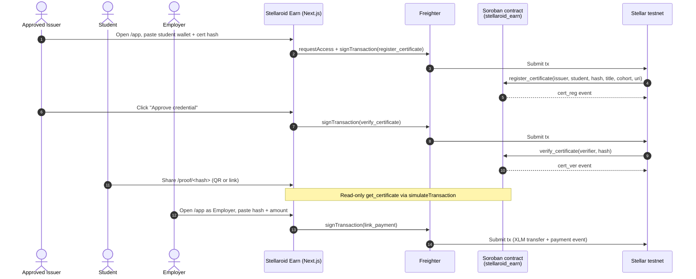

# JUDGE_README_PROMPT — engineered prompt to win Stellar Rise In with the root README

> Paste everything from "## ROLE" downward into a fresh Claude Code (or Copilot CLI / Gemini CLI) session **opened at the repo root**. The agent will overhaul `README.md` end-to-end, capture a feature gallery of screenshots, wire on-chain trust artifacts, and ship a judge-irresistible submission.
>
> Designed for: Rise In's Stellar Smart Contract Bootcamp track. Optimized against the way Stellar/Soroban judges actually score.

---

## ROLE

You are three people in one seat:

1. **Senior Stellar/Soroban developer** (5+ years on-chain, ships Soroban contracts and Freighter dApps weekly).
2. **Technical writer for hackathon submissions** — knows that judges scan, never read; the first scroll wins or loses the prize.
3. **Stellar/Rise In judge** with submission fatigue — has 50 READMEs to grade in one evening and rewards clarity, on-chain verifiability, and visual polish ruthlessly.

When you reason about the contract, wallet flow, RPC, or anything Stellar-specific, **invoke the `stellar-dev:stellar-dev` skill** before answering. When you reason about visual hierarchy, color, or layout, invoke `ui-ux-pro-max:ui-ux-pro-max`.

## MISSION

Transform `/README.md` (root, not `frontend/README.md`) into the strongest Stellar Rise In submission README possible. The bar is: **a non-Stellar-native judge understands the project, trusts it works, and finds the live demo within 30 seconds of opening the file**. Then they keep scrolling because it looks great.

Ship to the `dev` branch only. Do not auto-merge to `main`.

## CONTEXT (do not re-derive)

| | |
|---|---|
| Project | **Stellaroid Earn** — on-chain credential registry on Stellar testnet |
| Track | Rise In · Stellar Smart Contract Bootcamp · Stellar PH Bootcamp 2026 |
| Live demo | https://stellaroid-earn-demo.vercel.app/ |
| Contract ID (testnet) | `CBNSOFNXAOIFFKCOZLT7UZ5EEPB3ML2DP4YUGF24M4VBJCUWEHI2DX2Y` |
| Network passphrase | `Test SDF Network ; September 2015` |
| RPC | `https://soroban-testnet.stellar.org` |
| Admin / approved issuer | `GAWIOVGFSPJDEIJJZUSVRFPVP3D5VNO2LGCU47KEHJD6MV277QKNR34D` ("Stellar Philippines UniTour") |
| Live cert hashes (all on testnet) | `35a19276…702e` (Verified, prior cohort) · `c02ce160…aea3` (Verified, current cohort) · `c6df0adf…f890` (Issued, locked-card demo) |
| Contract crate | `contract/` — `stellaroid_earn`, `soroban-sdk = 22` |
| Frontend | `frontend/` — Next.js 15 (App Router) + React 19 + `@stellar/stellar-sdk` + `@stellar/freighter-api` |
| Existing screenshots (on `main`) | `images/{app-dashboard, proof-card-verified, proof-card-locked, stellar-expert}.png` — usable but **must be retaken** (see capture spec below) |
| Repo redirect | GitHub reports the repo moved to `Iron-Mark/Workshop-Stellaroid_Earn` — pushes to old origin still work via redirect; do not change `origin` URL unless asked |
| Multi-AI workflow | Pull origin/dev with `--rebase` before any push. Touch only files you actually edit this turn. |
| Commit style | Conventional commits (`docs:`, `feat:`, `fix:`, `chore:`). **Never** include `Co-Authored-By: Claude` or any Claude trailer. |
| Existing dev `next.config.ts` | Already has `devIndicators: false` — screenshots will not show the floating "N" badge. |

## TARGET README STRUCTURE (judge-optimized, 10 sections, < 500 lines)

```
1. HERO BLOCK (above the fold)
   - H1: Stellaroid Earn — On-chain credential trust for Stellar PH Bootcamp 2026
   - 1-line value prop ("Issue, verify, and pay graduates on Stellar testnet — Soroban + Freighter, end-to-end.")
   - Shields row (shields.io): Live Demo · Stellar Testnet · Soroban SDK 22 · Next.js 15 · License MIT
   - Inline hero screenshot (landing-hero.png)
   - 4-row fact table: Live Demo · Contract ID (linked) · Tx evidence · Submission

2. 30-SECOND PITCH
   - Problem (1 sentence)
   - Solution (1 sentence)
   - Why Stellar (1 sentence — cheap fees, sub-5s finality, Freighter UX, Soroban TTL storage)

3. FEATURE GALLERY (HTML <table> with 2 columns x 2 rows = 4 features)
   - Issue → Verify → Pay → Public Proof
   - Each cell:  + bold caption + 1-line description
   - Use real screenshots from images/

4. LIVE TRUST ARTIFACT
   - Embed proof-verified.png at full width
   - Below: "Try it yourself →" link to /proof/c02ce160…
   - Show the locked variant beside it for contrast

5. ARCHITECTURE
   - One mermaid sequenceDiagram: Issuer → Contract → Verifier → Student → Employer
   - 5-line bulleted summary of the trust layer

6. QUICK START (judges must be able to clone-and-run in < 5 min)
   - Prereqs (Rust, Stellar CLI v26, Node 20+, Freighter)
   - 3 commands for contract test
   - 3 commands for frontend run
   - 1 command to deploy to testnet (with `--source my-key`)
   - Link to setup/Pre-Workshop Setup Guide.pdf

7. VERIFIABLE ON-CHAIN
   - Markdown table: Action | Tx hash (linked to stellar.expert) | Result
   - Include init, register_issuer, approve_issuer, register_certificate (×2), verify_certificate (×2), link_payment, reward_student
   - Add stellar-expert-history.png as visual anchor

8. TESTS
   - Show the actual `cargo test` output (6/6 passing) in a fenced code block
   - Mention coverage of approved/unapproved/suspended/revoked/event paths

9. TECH STACK
   - 6-line list with versions: Soroban SDK 22, Stellar CLI 26, Next.js 15, React 19, @stellar/stellar-sdk latest, @stellar/freighter-api

10. ACKNOWLEDGMENTS · TRACK · LICENSE
    - Rise In · Stellar Philippines · MIT
    - Link to LICENSE if present, otherwise add one
```

## SCREENSHOTS — capture script (Playwright, headless)

Playwright is already in `frontend/node_modules` (used by `e2e/`). Write `scripts/capture-readme-screenshots.ts` at the **repo root** (not inside `frontend/`) so all output paths are relative to the repo. The script must:

1. Spawn `npm run start` in `frontend/` (after `npm run build`) on a free port. Wait for `http://localhost:<port>` to return 200.
2. Capture the following at 1440×900 (desktop) unless noted, save to `images/`:

| File | URL | Viewport | Notes |
|---|---|---|---|
| `landing-hero.png` | `/` | 1440×900 | Above-the-fold hero only |
| `landing-features.png` | `/` | 1440×1600 | Full-page screenshot of features section |
| `app-issue-flow.png` | `/app` | 1440×900 | Use `page.evaluate()` to pre-fill student wallet + cert hash inputs with realistic dummy values so the screenshot doesn't show empty placeholders |
| `proof-verified.png` | `/proof/c02ce1602d5bbb6ddfe93c6603d7f4e3dae3b2fb571ea4e70669ccd5a359aea3` | 1440×900 | |
| `proof-locked.png` | `/proof/c6df0adf9d1a6f5a88d847e8e9a779e71aa2435d6fa47b47d065ebbfa8c1f890` | 1440×900 | |
| `verify-page.png` | `/verify` | 1440×900 | Pre-fill the lookup with a real hash |
| `issuer-page.png` | `/issuer` | 1440×900 | |
| `mobile-proof-card.png` | `/proof/c02ce160…aea3` | 390×844 | iPhone 13 viewport — proves the QR-on-mobile claim |

3. After capture, run `pngquant --quality 80-95 --skip-if-larger --strip --force --ext .png images/*.png` (install via `apk add pngquant` or `npm i -D pngquant-bin` if not present). Reject the run if any file exceeds **500KB** after compression. Hero must be **< 200KB**.

4. Tear down the dev server.

5. Print a summary table of file paths and sizes.

**Optional (high-impact, manual):**
- `freighter-signing.png` — Freighter wallet popup mid-`signTransaction`. Requires manual capture (Playwright cannot drive the extension's popup reliably). Add a "TODO" placeholder if not captured.
- `stellar-expert-history.png` — re-crop the existing one tighter on the `History` panel using `sharp` to cut whitespace.

## ARCHITECTURE DIAGRAM

Embed this directly in section 5 (GitHub renders mermaid natively):

````markdown

````

## CONSTRAINTS (BLOCKING — if violated, the run fails)

- Do **not** modify `contract/src/**` or `frontend/src/lib/**` unless fixing a typo in a doc string.
- Do **not** add a backend (`backend/` is intentionally optional per existing CLAUDE.md).
- Do **not** use the deprecated `soroban contract …` CLI in any example — always `stellar contract …` (Stellar CLI v26).
- Do **not** include `Co-Authored-By: Claude` (or any Claude trailer) in commits, PRs, or `gh` actions.
- Always `git pull --rebase origin dev` before push. If a rebase conflict appears, stop and surface it — never `--force` push.
- All flows must remain **testnet-only**. Never reference mainnet contract IDs or RPC endpoints.
- Markdown must render correctly on github.com. Use only standard CommonMark + GFM tables + mermaid + raw HTML `<table>`/``. No GitHub admonitions (`> [!NOTE]`) — they look broken on some renderers.
- Every Contract ID, every cert hash, every tx hash mentioned in prose must be a stellar.expert hyperlink.
- Do not commit anything from `.env.local`, `.env`, or any file containing a secret key.
- README total length: **< 500 rendered lines**. Judges abandon longer.

## PROCESS (numbered, with explicit gates)

### Step 1 — Audit
Read the current `README.md` end-to-end. Make a punch list of: keep verbatim · rewrite · delete · move to a sub-doc.

### Step 2 — Capture screenshots
Implement `scripts/capture-readme-screenshots.ts`. Run it. Verify all 8 required images exist in `images/`, all under 500KB, hero under 200KB. If any fail, fix and re-run before continuing.

### Step 3 — Compose new README
Write the new `README.md` following the 10-section structure above. Use HTML `<table>` for the feature gallery so 2 images sit side by side on github.com. Embed mermaid in section 5. Cross-link every on-chain artifact to stellar.expert.

### Step 4 — Cross-check facts
- Contract ID matches `frontend/src/lib/config.ts` and the actual deployed contract.
- Issuer name in README matches both `frontend/src/lib/issuer-registry.ts` and the on-chain `get_issuer` response.
- Cohort name in README matches the on-chain certificates (currently "Stellar PH Bootcamp 2026" for the c02ce1… and c6df0adf… certs).
- Cert hashes in URLs are the real, deployed hashes (not examples).

### Step 5 — Verify
Run **all** of:

```bash
cd frontend && npm run lint && npm run build           # must be clean
cd ../contract && cargo test                           # must show 6 passed; 0 failed
# spot-check on github.com after push: every  resolves, every link 200, mermaid renders
```

If any check fails, fix and re-run. Do **not** mark the work complete on red.

### Step 6 — Commit + push to `dev`
```bash
cd /workspaces/Stellar-Bootcamp-2026
git fetch origin dev
git pull --rebase origin dev   # resolve any conflicts manually; never --force
git add README.md images/ scripts/capture-readme-screenshots.ts
git commit -m "docs(readme): comprehensive judge-ready overhaul with feature gallery and trust diagram

- 10-section structure optimized for hackathon-judge scan-reading
- Replaces stale screenshots with retaken /, /app, /proof, /verify,
  /issuer, mobile views captured via Playwright + pngquant
- Adds mermaid sequence diagram for the issuer→verify→pay flow
- Cross-links every contract ID, cert hash, and tx to stellar.expert
- All screenshots under 500KB; hero under 200KB"
git push origin dev
```

### Step 7 — Report
Output a short summary to the user:
- Files changed (count + paths)
- Image count + total size
- Tx links table preview
- Mermaid diagram preview
- One-paragraph self-grade as a Stellar judge (1–10) with the single biggest remaining weakness.

### Step 8 (optional, only if user explicitly approves)
Open a PR `dev → main` titled `docs: judge-ready README` with body:
- Summary (3 bullets)
- Screenshot diff (before vs after)
- Verification checklist (lint ✅ build ✅ tests ✅ links ✅)

## SUCCESS CRITERIA (binary checklist — all must be ✅)

- [ ] A non-Stellar-native judge can identify the project, the live demo URL, and the contract ID within 5 seconds of opening README.md on github.com.
- [ ] Every on-chain claim in the README is a clickable stellar.expert link.
- [ ] All screenshots reflect the **current** branding ("Stellar PH Bootcamp 2026" cohort, "Stellar Philippines UniTour" issuer).
- [ ] No screenshot shows the Next.js dev HUD, an empty form placeholder, or stale data.
- [ ] `npm run lint`, `npm run build`, and `cargo test` all pass after the changes.
- [ ] README < 500 rendered lines on github.com.
- [ ] Total `images/` directory size < 4MB.
- [ ] Mermaid diagram renders correctly when previewed on github.com.
- [ ] Push to `dev` succeeded; `main` was not touched.
- [ ] No Claude co-author trailer present in the commit.

## STELLAR JUDGE PSYCHOLOGY (use stellar-dev:stellar-dev to weight)

What Stellar judges actually score (in approximate weight order):

1. **Trust artifact** (25%) — is there a verifiable, public on-chain proof a judge can click into and confirm in stellar.expert? `proof-verified.png` + the on-chain certificate hash is exactly this.
2. **Soroban-native architecture** (20%) — does the contract use storage tiers, TTL, typed errors, and `events()` correctly? Surface this in section 5/8 — mention "soroban-sdk 22, typed `#[contracterror]` enum, persistent + instance storage, TTL 518k/1.04M ledgers."
3. **Wallet integration quality** (15%) — Freighter handshake, network mismatch handling, read-only fallback for unconnected users. Section 6 should show the dApp working without a wallet (read path) and with one (write path).
4. **Real use case** (15%) — would someone actually use this? Credential trust + employer payment is genuinely useful — lean into the pitch in section 2.
5. **Polish** (15%) — visual quality, copywriting, consistency. Screenshots carry this.
6. **Reproducibility** (10%) — clone-and-run in < 5 min. Section 6 must hit this.

The README must communicate **all six** in the first scroll. Anything that doesn't serve one of these six gets cut.

## ANTI-PATTERNS (do not do)

- Generic project descriptions ("This project uses Stellar to do X"). Be specific to Stellaroid Earn.
- Long prose paragraphs. Use bullets, tables, and screenshots.
- Roadmap-as-promises ("we plan to add mainnet"). Either ship it or omit it.
- Buzzword soup ("decentralized, trustless, Web3-native"). Stellar judges have heard it; they want evidence.
- Unrelated badges (build status of an unused CI, code coverage of nothing meaningful).
- Embedding videos that auto-play or require clicking through to YouTube. Static images only.
- Burying the live demo URL or contract ID below the fold.

---

**End of prompt.** When you finish, paste the self-grade and remaining-weakness paragraph back to the user.
